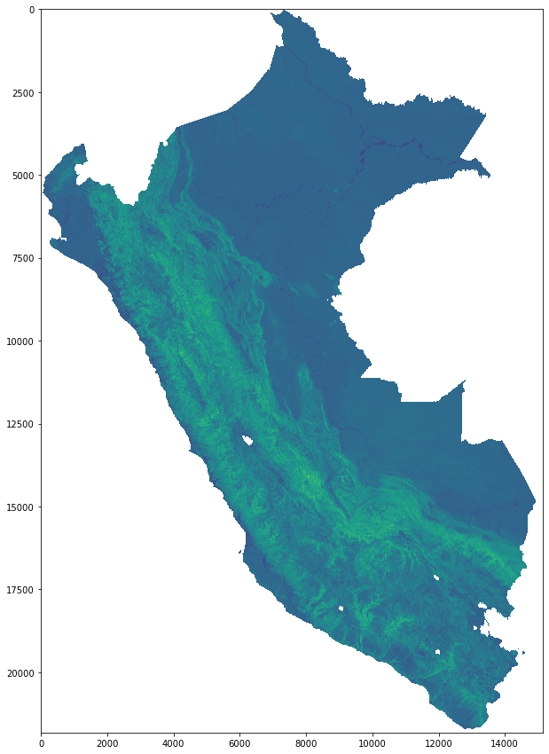
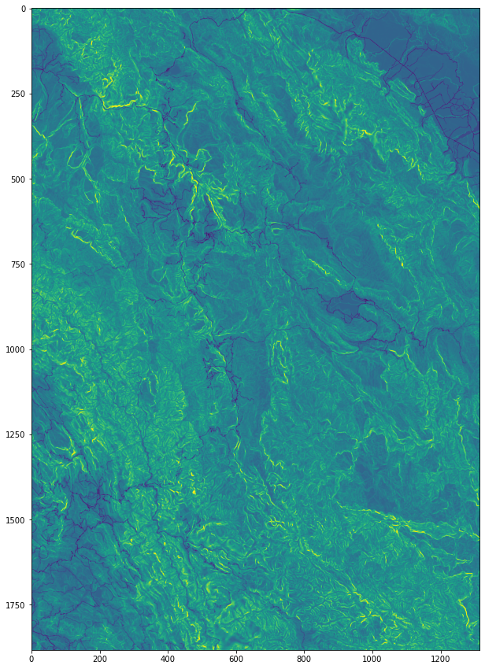
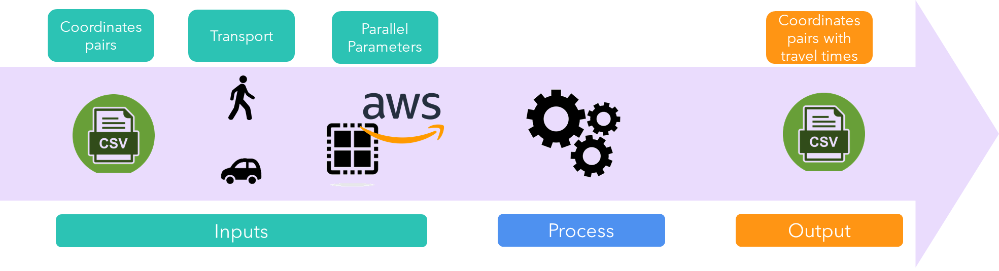
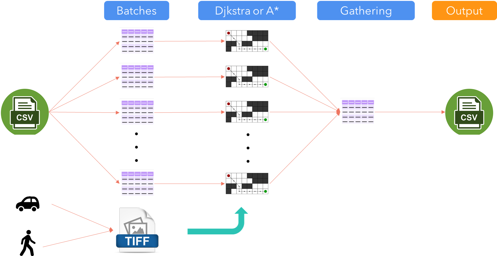
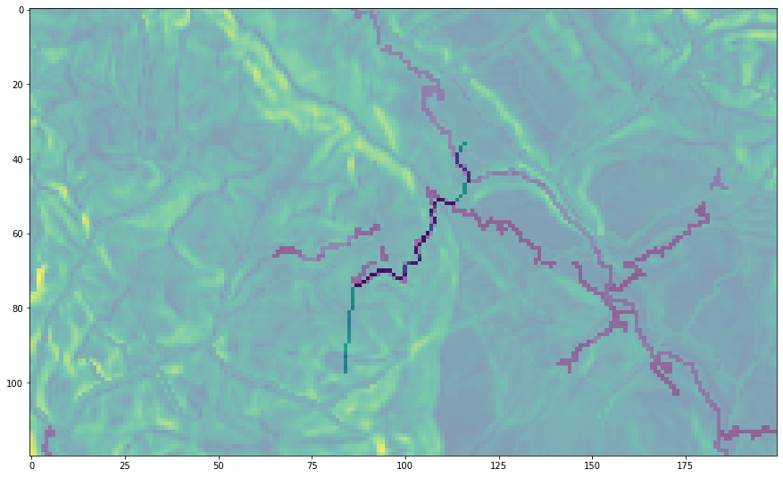
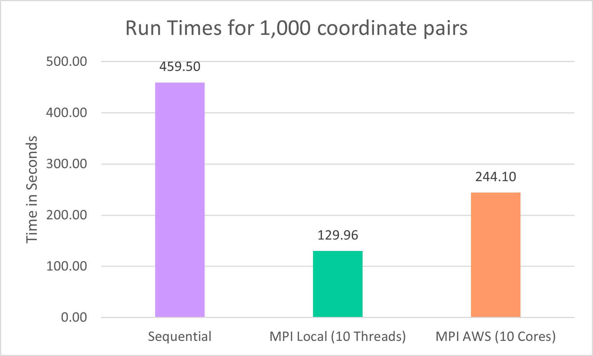

# MACS 30123: Large-Scale Computing. Peruvian Time Matrix

## Andrei Bartra 
### June 2021
--------

## Introduction 

In Peru, there is a high demand for travel estimations between schools. These calculations are essential to determine Public School teacher's salaries, identify places to construct new schools, and academic research.

Currently, this process is performed locally, sequentially, and using licensed software (ArcGis) which is not available for all the potential users. Furthermore, the pathfinding algorithm runs in a heavy raster, making each calculation extremely low. A typical query of travel times between a few thousand schools can take weeks to run.

This project is an attempt to make use of parallel computing and cloud resources to optimize the process. Even though there is still room for optimization, the current results look promising.

## Data
The information consists of two rasters or 2d arrays (tiff files), where each cell represents an area of 90x90 meters in Perú. The value of each cell represents the time it takes to traverse it (also known as "time cost"). One raster considers 

These costs are estimated considering two variables: (i) the slope of the terrain, where the cost is modeled as an exponential function of the slope. And (ii) the presence of a transportation route. The speed is fixed at 60 kph for the motorized version and 5kph for the walk version in motorways. The motorized version considers that navigable rivers can be traversed at 15kph.

The tiff files are georeferenced; therefore, it is possible to map any coordinate to a cell in the array. 

In this closeup, the presence of roads can be identified by the darker blue lines:

## Solution Design

It is essential to arrive at a user-friendly solution. Most of the potential users of this tool are proficient with statistical packages like Stata, and R. A user should use the tool just by inputting the required coordinates pairs in a tabular data structure (i.e., a CSV file) output should be of a similar format. 

Moreover, it is important to have a solution that can be run locally or with cloud resources. Many of the potential users do not have the resources to open an AWS account.

Under the hood, the process is a simple map-reduce. The list of coordinates pairs is distributed to workers in chunks. Then, each worker performs a pathfinding algorithm (Dijkstra or A*), consulting the raster for each coordinate pair. Each worker returns the total cost of the shortest path for each coordinate pair. 

This process can be further improved with a delayed array structure for the raster, so the worker does not load the whole raster. 

## Current Implementation

In an ideal scenario, it should be possible to implement the process with Dask with a custom A* algorithm optimized with Numba. That way, Dask automatically distributes the coordinate pairs to the workers, and the raster array is loaded in a delayed fashion. 

Nonetheless, the current implementation of the Fibonacci Heap, required for the A* algorithm, needs further improvement. There are several corner cases for which the code does not run correctly.

Several options were explored. An option was to replace the custom A* algorithm with the NetworkX build-in function. However, NetworkX does not accept delayed structures and the graph structure for a 2d grid takes a lot of memory.  PyWren was considered for the distribution process in the cloud; however, Lambda functions impose a limit on the RAM.

The current solution uses the Scikit-Image built-in function for the shortest path, which applies a Dijkstra algorithm in rasters. The function does not accept Dask arrays, and it cannot be applied in a Dask-Dataframe. However, it is implemented in C, so there is no need to optimize with Numba.

For the distribution, I had to resort to MPI. It is pretty basic parallelization but bulletproof. It is also possible to run MPI processes in EMR clusters customized for Dask jobs. 

In this picture, there is an example of the pathfinding result of a particular coordinate pair. 

The path follows the lowest resistance cells until it finds roads (darker lines). Then, it follows the road until it has to return to terrain without roads. 

## Results

To illustrate the results, I focused on a particular UGEL, an administrative unit. UGELs are somewhat similar to a school district. I took the schools in rural areas and created all the pair combinations (the lower triangle of the adjacency matrix). This UGEL, Chachapoyas, is located in a mountainous jungle area in the country's northern center. The total amount of pairs is 8,256. To test the performance of the solutions, I took a sample of 1,000 pairs. 

The sequential solution without parallelization took around 8 minutes to run. UGEL Chachapoyas is a small UGEL from a total of 210. Furthermore, many queries require estimating travel times without the restriction of UGEL. One can imagine how this process can scale up to the point of taking several weeks to run.

The same job, run with ten parallel threads, improves substantially with a total run time of 2 minutes. The same process in the EMR cluster, with the same number of threads, did not perform that well. An explanation is that the distance impairs the communication speed between EC2 instances. Furthermore, the cluster was no customized for MPI jobs. Sadly, the current limit for EC2 instances in my account is five units. Nonetheless, the potential to scale up the process is there. With a different account and the ability to request "metal" units, the performance should improve considerably. 

## To Do

There is plenty of room for improvement. Specifically, it should be possible to solve the issues with the custom implementation of the A* algorithm. That way, it should be possible to implement a delayed data structure for the array.

Another interesting addition would be to set up a DynamoDB service to store the travel times of all previously run jobs. That way, if the query entails pairs already calculated in the past, the results can be retrieved almost instantly. 

Finally, if resources are available, the project can be deployed as an API in AWS so that anyone can make travel time estimates from anywhere. 

## Organization of the Code

- [time_matrix_peru.ipynb](time_matrix_peru.ipynb) is a notebook with the local implementation.

- [time_matrix_peru_aws.ipynb](time_matrix_peru_aws.ipynb) is the notebook that was uploaded to the EMR cluster. It contains all the results from the local version plus the outputs from the EMR cluster.

- [FibHeap.py](FibHeap.py) is the current implementation of a custom Fibonacci Heap that is required for the A* algorithm.

- [fib_heap.py](fib_heap.py) is a third-party implementation of the Fibonacci Heap data structure. This implementation did not solve the encountered issues.

- [pywren_code](pywren_code.py) is the attempt to implment the distribution with PyWren.

- [astar.py](astar.py) is the current implementation of the A* algorithm.

- [mpi_code.py](mpi_code.py) is the module customimzed to run with mpirun. Similar to the one present in the notebook.

- [final_presentation.pptx](final_presentation.pptx) is the presentation of the project.
